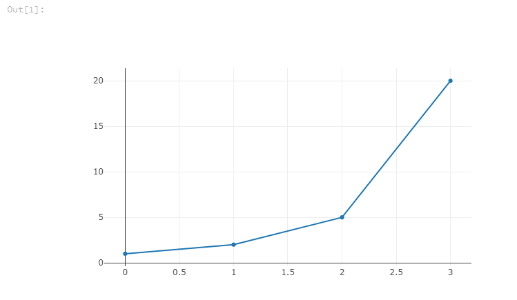

# iruby-plotly

A shim to support using [Plotly](https://plot.ly/) in IRuby Jupyter notebooks.

## Requirements

* IRuby
* JupyterLab
* [plotly-extension](https://github.com/jupyterlab/jupyter-renderers/tree/master/packages/plotly-extension)

```bash
jupyter labextension install @jupyterlab/plotly-extension
```

## Usage

```ruby
require 'iruby/plotly'

IRuby.plotly([{y: [1,2,5,20]}])
```

or (convenience method)

```ruby
IRuby.plot([1,2,5,20])
```

or (convenience method)

```ruby
IRuby.plot(y: [1,2, 5, 20], x: [0,1,2,3])
```


